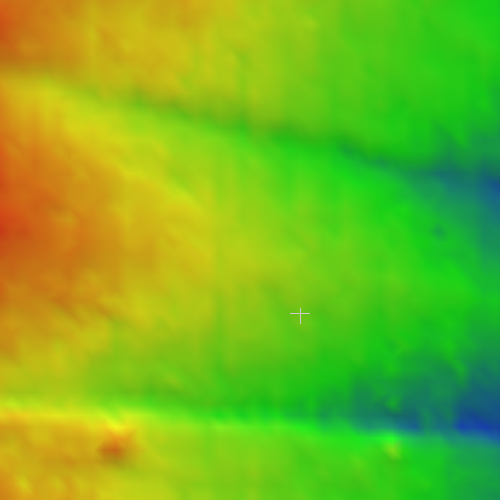
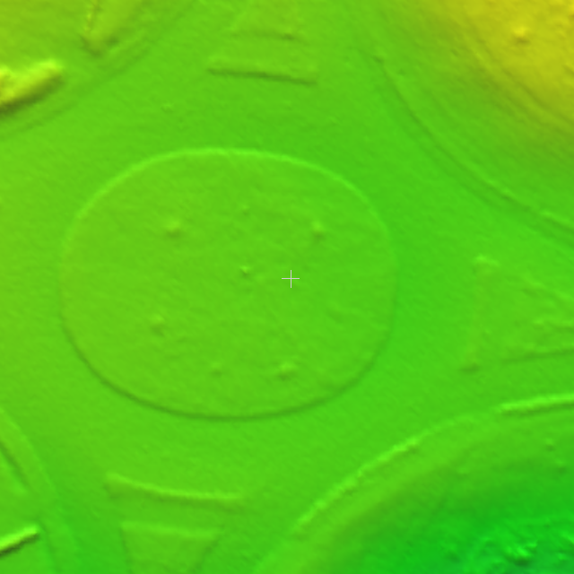
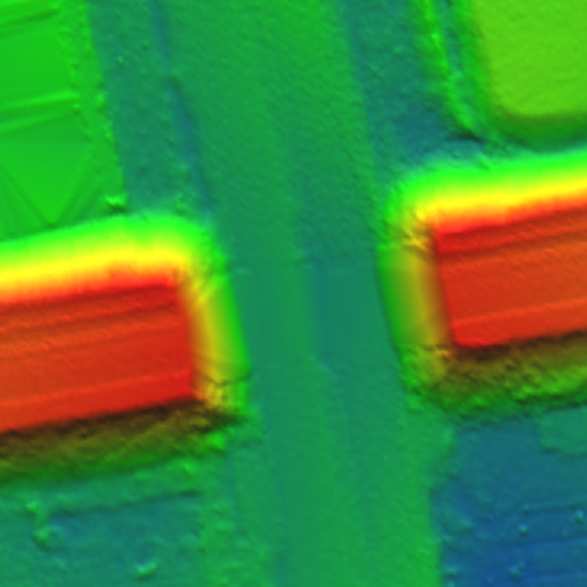
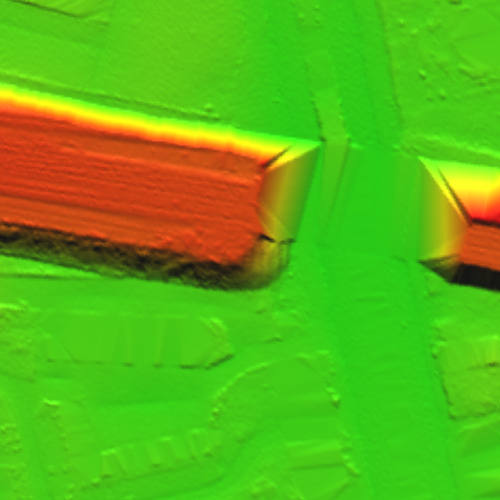
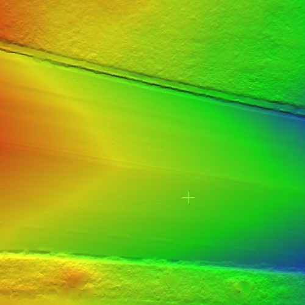
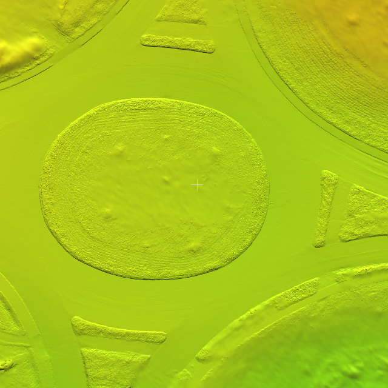
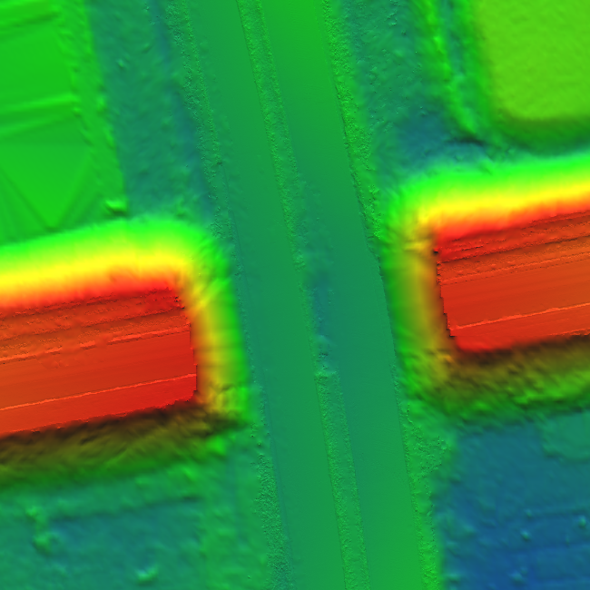
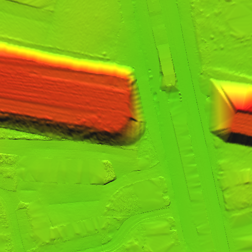

# ENHANCING THE RESOLUTION OF URBAN DIGITAL TERRAIN MODELS USING MOBILE MAPPING SYSTEMS

A library which aims to convert the Mobile Mapping LiDAR Point Cloud to Digital Terrain Model(DTM). The whole process can be understood as ground filtering on mobile LiDAR data. The library offers also the possibility to use an given DTM (e.g. ALS) with low resolusion as a prior to generate a mix of low and high resolusion DTM.

## Key features

- Ground filtering with grid based approach (Wack and Wimmer, 2002)
- Merge method for DTMs in different resolution
- Height adaption based on one of the DTMs
- The processing support distributed computing using python multiprocessing units.

## Input structures

Input of the data should be partitioned into grids based on a global origin and grid size. The number of each grid in x and y direction are then calculated in hex number in 8 digit, e.g. ffffffff_00000001. This step make the file name contains coordinates in global coordinate system.

**The point clouds from different epochs should be first aligned, the registration step is not included in this repository.**

## Comparisions 

Following are the comparision between the DTM with different resolution.

 

    
## Commands

Preprocessing ALS: merge ALS DEM tiles with raster merge, then gdal2xyz to points
    
    python alignedREF.py
    python rejectOutliers.py
    python alignedDTM.py
    python collectDTM.py

## Citation:

Please cite this paper in your publications if it helps your research:

    @Article{isprs-annals-IV-4-W6-11-2018,
      AUTHOR = {Feng, Y. and Brenner, C. and Sester, M.},
      TITLE = {ENHANCING THE RESOLUTION OF URBAN DIGITAL TERRAIN MODELS USING MOBILE MAPPING SYSTEMS},
      JOURNAL = {ISPRS Annals of Photogrammetry, Remote Sensing and Spatial Information Sciences},
      VOLUME = {IV-4/W6},
      YEAR = {2018},
      PAGES = {11--18},
      URL = {https://www.isprs-ann-photogramm-remote-sens-spatial-inf-sci.net/IV-4-W6/11/2018/},
      DOI = {10.5194/isprs-annals-IV-4-W6-11-2018}
    }
